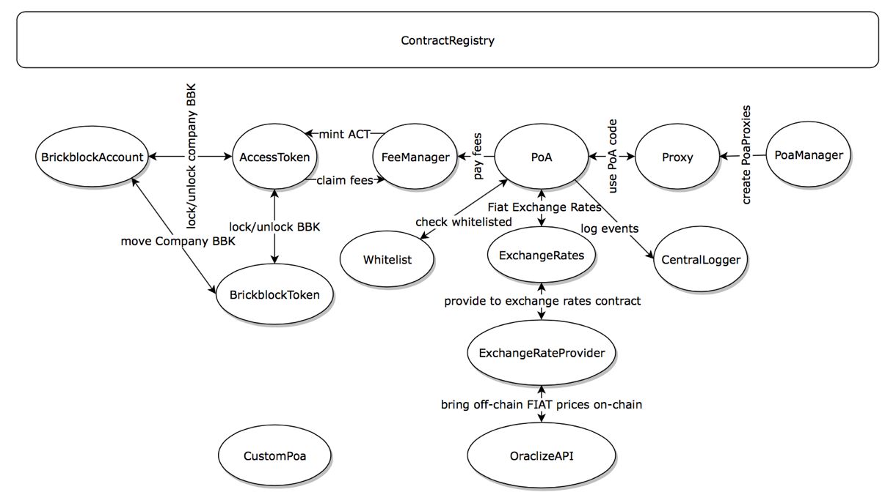

## Contract Ecosystem Overview

The ecosystem is powered by 13 different contracts. 1 additional contract is a standalone contract which is meant to be an early stage proof of concept which does not rely on the rest of the ecosystem.

## Table of Content

* [ContractRegistry](#contractregistry)
* [BrickblockToken](#brickblocktoken)
* [AccessToken](#accesstoken)
* [FeeManager](#feemanager)
* [Whitelist](#whitelist)
* [ExchangeRates](#exchangerates)
* [ExchangeRateProvider](#exchangerateprovider)
* [OraclizeAPI](#oraclizeapi)
* [CentralLogger](#centrallogger)
* [PoaManager](#poamanager)
* [PoaProxy](#poaproxy)
* [PoaToken](#poatoken)
* [BrickblockAccount](#brickblockaccount)

Standalone Contract:

1. `CustomPoaToken`

## Overview Diagram


[Brickblock Ecosystem Chart](https://www.draw.io/?lightbox=1&highlight=0000ff&edit=_blank&layers=1&nav=1#R7Vzfc5s4EP5r%2FJgMSObXo%2B0mvc5d5zxt59o%2BKiBjTTDyAU6c%2FvUnGQmDJFLXBuLe4JfACoTQftpvtbtkAheb%2FfsMbdcfaYSTCbCi%2FQS%2BmwBgT6HF%2FnDJSynxvKAUxBmJxEVHwWfyAwuhuC%2FekQjnjQsLSpOCbJvCkKYpDouGDGUZfW5etqJJ86lbFGNN8DlEiS79SqJiLaS2ZR0b%2FsAkXotH%2B45oeEDhY5zRXSqeNwFwdfiVzRsk%2BxLX52sU0eeaCN5N4CKjtCiPNvsFTvjcymkr77tvaa3GneG0OOkGjKDNtGNFIESBD29ED08o2Ym5mIUhzvMv9BGnE%2BAmrNv5Q8aHXryI6XL%2F3fHxzlc0LW7ygzJn7AIbbBkg5sd2dhSXf0HjfsDGxDTLTubPa1Lgz1sU8pZnBi4mWxebhJ3Z7PAws5iP3WJn1eTxppBuSCgaEvSAk3mligVNaMaaUpryZ%2BRFxl5GCpmGrMOvapEa572uSJLUrrw%2F%2FMSr3qMNSTjA%2F8FZhFIkxALNNhDnpgehhMQpk4VMTTirpqSuN6kInBV4XxMJPb7HdIOL7IVdIlqhxKBYc44vzp%2BPCA6EaF3DridkSKyZuOr5iBt2IKBzIoxcDUYSO%2FkWpReh5yuHSELyQvbIBld2OqKrP3RNXaeBLjdwNHRV5rEOL7cPeHn9wWtJZyOwBgSWC39utozA6sVu%2BRqwlhR9ZLMUs%2Fcd9d%2BD%2FgOg6N%2FzbnXTMhhxBRoA7jEeAdAjABzrivwWuQHpg1nmGQkfHxIaPjKXmul3dGCGhJk9VWEGDHbGBiYXxukDafpOqzOk3e3DNUpj%2FAkVbBc9omxAbwZUqKocZYM%2FYzs9OcomUKl6TqMZD5HwN09QnnOFsUlHWaGLa1rHe1J846pl71eefZctKRtlrYmffhcgOFFFrTOf010WyqBMyy6ADT3GRcs1ckZw1Ij46Aqsqccx2AApy3CCCvLUjBOZVCaesKSEG%2FoKH21kJ7soX1jcVQ%2FcKB15brMj11aMVDkrWkcHBFWvfRqogO4TEcTHIu0MOxSmRsEaWzWFYjwws1%2Fo4XABB8iWD%2FAwZGc%2Bcd6ZliVffSREyUw0bEgU8fvbLMwx5nYJ%2FtqWfhV0FC8xqQfuTCbBurWsqd1Q1g3oBEyOsVN5P12tcnyx7p1uWOoVZ6gRWRxJagCSglAlKQ8aSAqYSKoLV8gUHOyIpCoqahBRRVnfamQm6atXipL7iQZHOVdFSX6TSKbWmYxkK4GcKh7dAyPp8b8NfeI0tKAbZj745M3nf%2F6f6EiumS7oSCbjXhr9nAujbvlGD8BxjmC37dLygL3vayoeyHCULWuakR9MdygZwt012pKW%2FN2V2hZfoY9zbcsU9ubtSjKq25ZyLLPFl9PgZto11bFTx5s9GXLHFPx2CAJqVjM4k56A0%2FTBHQf2BiGoQYiBg2yYaIUNu6SfgshonOwW09S%2FT3MCiIKrAtGNEvvzwLk%2BjrLpVmPQHWJoqmFoi17ORpDJDB2jNbohMtNbq%2Bvz5mGeEW%2BX4k3f6IdrfHC4nmXBBdtOd%2B1uafSnQqyg22vAlzvi60J86Zv%2BMMOo4Ju2JUXLjO7JMVfBC8zaIkCnkuUpBq1XXPk6ruCpW3%2BpaOvWtiy%2FoSTJv28DNR%2BeCbVA6cgFp%2FlfTNkH3pOXiR268VGdbkWBHmRQt6K9bEAHTqKYvLnrClDdOB1BEKo1bGrypUNzp9eR9JLdZXbziUS8NGWMnw%2BX5LWaW0nPlOJ1fH1BdFGyIsHfB7L%2BzlCYsMtmyw8joN4QUIE1JKB6rBloIbWuQxTgpLjWdQW2HE9NwvnnZl70ohOvv9zLVLc%2F25KEuAIon%2BBjVUBWVgXwHEXBbEuhAev3zcjAtlV%2BTkbGdb2G%2FqRXdhU5GQg0jT9kJI2ZiPV%2Fw5RNOO3cf5h94XOUkfCgc5rKpv6Nibk4qWvfWVJv3cyA64o8VdVmF9sUpSOvv9AA1MPlnXk0Cw4TlPxF43h0kgf1aXyl0s1YB9nXdx1Qj2byCNPL%2BAHjFSPGU7LFQ34IAPVgzy4vY5OzA6Nz96ZjHjMEKNvzNL2GLuVyedV%2F9q6K6Hy1nH96ZmmBp5RRuipjdkh0enFLd0S3ywu6WVLUmYkbuXLAgswmBgNr0G9ToB6sTCh37%2FETlrH2y%2BsVXq%2FCvI68n3RFf5%2F8jG1BXmDuurbl%2BZ4fWG7TmgF4awVBYNu%2B49qureRcTk7eqEYSnFZ%2F9WbJm6ke1FqIGMQnHJNcrpA6rI8Wyv65ObsUmb%2Fw4ZrygezUNbhFRtPw634ROz3%2B75Fy2o%2F%2F4AXe%2FQc%3D)


## General
### Version Numbers
Version numbers are used for each contract. They are set as `uint8 public constant`s

### Interfaces
Interfaces are always prefixed with an `I`. Example: `IPoaManager`. Interfaces can all be found in `contracts/interfaces/`

## ContractRegistry
`ContractRegistry` is an integral part of the ecosystem. It's the interface through which our contracts talk to each other. It also allows for swapping out contracts for newer versions (except PoA tokens, check the [Upgradeability section](#upgradeability) for details). This will allow our smart contracts to evolve and improve over time along with the needs of the project.

It has a single private mapping which maps `bytes32` to `address`es. A given `string`, converted to `bytes32` by hashing the string using `keccak256`, will return a corresponding `address`.

There are two getters: `getContractAddress` allows usage of `string`s and `getContractAddress32` allows direct usage of `bytes32` (useful when writing assembly code).

There is a single `onlyOwner` setter, `updateContractAddress` to update the address of a given contract name, or to add a new contract to the ecosystem.

## BrickblockToken (BBK)
`BrickblockToken` is an ERC20 [`PausableToken`](https://github.com/OpenZeppelin/openzeppelin-solidity/blob/master/contracts/token/ERC20/PausableToken.sol) with additional features enabling it to:

* send out tokens from the token sale
* finalize the token sale according to previously agreed upon terms
* approve the [BrickblockAccount](#brickblockaccount) contract to transfer company tokens
* change the stored address for the fountain contract

`finalizeTokenSale()` is the most noteworthy function which finalizes balances once after the token sale has finished. There are three main groups among which percentages are allocated:

1. `contributorsShare`: 51% of all tokens were sold in our token sale
1. `companyTokens`: 35% of all tokens belong to the company and are locked until November 30th of 2020
1. `bonusTokens`: 14% of all tokens are used for partner deals, bounties, airdrops, employee incentivization etc.

When calling `finalizeTokenSale()`:

* All unsold tokens from the `contributorsShare` will be burned.
* It sets approval for [BrickblockAccount](#brickblockaccount) to run `transferFrom` and lock the `companyTokens` into the [AccessToken](#accesstoken) contract.

`BrickblockToken`s (BBK) can be locked (or "activated") into the [AccessToken](#accesstoken) contract, to start generating ACTs.

### Important Notes
#### BrickblockFountain was renamed
Initially, we planned to have a contract called `BrickblockFountain` managing the locking/unlocking of BBK and minting of ACT. That's why the deployed `BrickblockToken` contract on mainnet has a `fountainContractAddress` value. `BrickblockFountain` does no longer exist, it has been split up into the [FeeManager](#feemanager) and [BrickblockAccount](#brickblockaccount) contracts.

#### toggleDead() is just for cosmetic purposes
There is a `toggleDead` function which sets a cosmetic `bool` variable. It is a flag for the worst-case scenario of having to re-deploy the contract due to a security vulnerability to inform users that this contract should be considered `dead`.

## AccessToken (ACT)

The `AccessToken` contract allows for locking (or "activating") BBK through `transferFrom` and allows distributions of ACT to be triggered from [FeeManager](#feemanager). Distributions are handled through manipulating the `balanceOf()` function as well as some neat dividend tricks. ETH redemption is done through burning ACT on the [FeeManager](#feemanager) contract.

### General Overview
`AccessToken` (ACT) is an ERC20 compliant token which is redeemable for ETH at a **"1000 ACT : 1 ETH"** ratio. This redemption is handled by the [FeeManager](#feemanager) contract. ACT can only be acquired through locking in [BBK](#brickblocktoken).

**Locking in BBK means:**

Transferring a given amount of BBK to the `AccessToken` contract through the `lockBBK()` function. Transferred balances are owned by the `AccessToken` contract at this point. A record of the sender's balance is kept to be able to unlock at any given time after locking.

**Unlocking BBK means:**

Calling the `AccessToken` contract function `unlockBBK()` with a given amount that is less than, or equal to the originally locked BBK balance. This transfers the given amount of tokens back to the original owner.

---

Every time a fee is paid in the Brickblock network, ACT is distributed through the `AccessToken` contract by [FeeManager](#feemanager). **Only [FeeManager](#feemanager) can distribute (or "mint") ACT.**

Locking tokens puts the user into the distribution pool for ACT when they are minted during fee payment events in the ecosystem. BBK tokens must be locked *before* a fee is paid to receive ACT from a given distribution.

The amount of ACT a user gets is a proportion of their own locked BBK to the total locked BBK. ACT can be redeemed for ETH through the [FeeManager](#feemanager) contract which burns a given amount of ACT for a user and sends ETH from its fee pool in return **at a fixed rate of 1000 ACT for 1 ETH**.

### Technical Concepts
There are a few key concepts here that need to be explained to fully understand the `AccessToken` contract.

#### Locking & Unlocking BBK
This was mostly covered above, but there are a few things worth mentioning. To `lockBBK()`, a user must `approve()` the `AccessToken` for at least the amount the user wants to lock. The user must then call `lockBBK()` *after* the `allowance` has been set. `lockBBK()` is essentially calling a `transferFrom()` on the [BrickblockToken](#brickblocktoken) contract along with recording ownership of the `lockedBBK`.

`unlockBBK()` simply transfers locked BBK tokens back to the owner's wallet.

Using the [ERC223 Standard](https://github.com/Dexaran/ERC223-token-standard) would have been great here, but it was not known about at the time of deploying [BrickblockToken](#brickblocktoken) in 2017.

#### ACT distribution or minting
There is a somewhat unique way of handling dividends in this contract.

Imagine that there are 5 BBK tokens locked into the contract; you own 2 of those 5. Now 10 ACT tokens are distributed to the contract. What `AccessToken` does is simply take this amount (10) and divide that by `totalLockedBBK` (5). This will result in 2 ACT per locked in BBK token. This is the `uint256 totalMintedPerToken` in the contract. So you would be allocated 4 ACT in this distribution.

```js
// js pseudo code
const yourLockedBBK = 2
const totalMintedPerToken = 10ACT / 5BBK = 2
const yourBalance = totalMintedPerToken * yourLockedBBK = 4
```

Now, what happens if there are multiple distributions? Perhaps another distribution of 10 ACT? `totalMintedPerToken` is now 4

```js
// js pseudo code
const yourLockedBBK = 2

// distribution 1
const totalMintedPerToken = 10ACT / 5BBK = 2
const yourBalance = totalMintedPerToken * yourLockedBBK = 4

// distribution 2
const totalMintedPerToken = (10 + 10)ACT / 5BBK = 4
const yourBalance = totalMintedPerToken * yourLockedBBK = 8
```

But, what happens if you want to claim some of these tokens and move them? We need to account for that. That is what `distributedPerBBK` handles. We deduct the distributed amount per user to get the real amount of ACT readily available. When a user transfers or redeems ACT.

```js
// js pseudo code
const yourLockedBBK = 2
const totalMintedPerToken = 10ACT / 5BBK = 2
const yourBalance = totalMintedPerToken * yourLockedBBK = 4

// you withdraw/claim last round of distributions
const distributedPerBBK = 4
const yourBalance = (totalMintedPerToken * yourLockedBBK) - distributedPerBBK = 0

// distribution after claiming
const totalMintedPerToken = (10 + 10)ACT / 5BBK = 4
const yourBalance = (totalMintedPerToken * yourLockedBBK) - distributedPerBBK = 4
```

There is one last piece to the puzzle that is missing. What happens when you transfer BBK to another address? Won't you have an inaccurate balance when it's based on tokens? We handle that by setting a user's `distributedPerBBK` to `max` and using another variable to store the rest of the balance that was there before the transfer. This is done for both the receiver and the sender. This is called `securedTokenDistributions` in the `AccessToken` contract.

```js
// js pseudo code
const yourLockedBBK = 2
const totalMintedPerToken = 10ACT / 5BBK = 2
const yourBalance = totalMintedPerToken * yourLockedBBK = 4

// you withdraw/claim last round of distributions
let distributedPerBBK = 4
const yourBalance = (totalMintedPerToken * yourLockedBBK) - distributedPerBBK = 0

// distribution after claiming
const totalMintedPerToken = (10 + 10)ACT / 5BBK = 4
const yourBalance = (totalMintedPerToken * yourLockedBBK) - distributedPerBBK = 4

// transfer 4 ACT token away
distributedPerBBK = 8
const securedTokenDistributions = (totalMintedPerToken * yourLockedBBK) - distributedPerBBK = 0
const yourBalance = (totalMintedPerToken * yourLockedBBK) - distributedPerBBK + securedTokenDistributions = 0
```

For further reading, please see the [commented glossary](https://git.brickblock-dev.io/platform/smart-contracts/blob/master/contracts/AccessToken.sol#L8-50) at the top of the `AccessToken.sol` file.

#### `balanceOf()` Override & Additional ERC20 Overrides
It is almost never a great idea to run a huge `for`-loop in solidity. But we need a way to distribute all of these ACT to `lockedBBK` holders. How is that done? Enter `balanceOf()` as an algorithm.

The easiest way to understand this is through a simplified version of this concept: [NoobCoin](https://github.com/TovarishFin/NoobCoin). NoobCoin is a project which implements this and only this. It is a good starting point for understanding this concept.

Essentially, instead of just returning a number, we are giving a starting balance, plus received amounts, minus sent amounts. What this boils down to is the ACT distribution value mentioned in the section above plus received balances and minus sent balances.

```sol
// solidity pseudo code

// how much BBK you have locked in
totalMintedPerToken = lockedBBK[_address]
    // multiplying by totalPerToken minus distributedPerBBK
    .mul(totalMintedPerToken.sub(distributedPerBBK[_address]))

    // add any balances bumped during transfers
    .add(securedTokenDistributions[_address])

    // deduct everything you already spent from transfers/transferFroms
    .add(receivedBalances[_address])

    // add everything you received from transfers/transferFroms
    .sub(spentBalances[_address]);
```

With this algorithm, we can allocate ACT to users without actually distributing. A consequence is that we need to make the `balances` mapping private, unlike the ERC20 standard, to ensure that the correct balances are being returned rather than the `balances` mapping which is no longer accurate or used. So consequently, `transfer` and `transferFrom` are modified to use the `balanceOf()` function rather than `balances` mapping.

#### ETH redemption for ACT
ETH redemption is done through the [FeeManager](#feemanager) contract which can `burn` a given users balance. When `burn`ed, `AccessToken` simply increments the `spentBalances` of the user and decrements the `totalSupply`.

## FeeManager
`FeeManager` is the link between [PoaToken](#poatoken)s where fees are paid and [AccessToken](#accesstoken) where the actual fee is distributed in ACT.

It has two primary functions and two supporting utility functions. It holds all unclaimed ETH and does not store any data other than the location of the `ContractRegistry`.

### `payFee()`
A payable function that calls the [AccessToken](#accesstoken) contract's `distribute()` which mints and distributes ACT at a ratio corresponding to the following ACT:WEI rate:
**1000ACT: 1ETH = 1000ACT: 1E18WEI**

This is how `lockedBBK` holders receive ACT.

This function can be called by anyone. Meaning anyone can pay a fee if they really wanted to. For the ecosystem, it is used by [PoaToken](#poatoken)s when a fee must be paid.

ETH is held in this contract which can be redeemed using `claimFee()`.

### `claimFee()`
This function can be called by a user with a given amount of ACT to claim. The claim amount must be equal to or less than the user's ACT balance. ETH is sent to the user based on the ACT:WEI rate (1000: 1e18). The ACT tokens used to claim ETH are burnt using the [AccessToken](#accesstoken)'s `burn()` function. Only `FeeManager` can call `burn()`.

### Interfaces
The following interfaces are used:

1. `IAccessToken`
    * To call the `distribute()` and `burn()` functions previously described.
1. `IRegistry`
    * To dynamically access `AccessToken` and `ExchangeRates`
1. `IExchangeRates`
    * To get the ACT:WEI rate

## Whitelist
`Whitelist` is very similar to [ContractRegistry](#contractregistry); it has a single `address => bool` mapping called `whitelisted` and it is [Ownable](https://github.com/OpenZeppelin/openzeppelin-solidity/blob/master/contracts/ownership/Ownable.sol).

The `whitelisted` mapping can only be updated by the `owner`. KYC information for `PoaToken` buyers is kept off-chain, complying with GDPR requirements (privacy) while still retaining a record of who owns which Ethereum address for AML compliance. Off-chain information is verified through KYC providers. Once this KYC process has been completed, the respective `address` is added to the Whitelist mapping.

If required, other contracts will check if an address is whitelisted through this contract. An example is the [PoaToken](#poatoken)'s `buy` and `transfer/transferFrom` functions.

### Future
This contract will likely have to be extended with more granular whitelisting features to comply with regulation in different jurisdictions or to allow brokers to only target a selected audience with their token offerings.

## ExchangeRates
`ExchangeRates` is an oracle (powered by [Oraclize](http://www.oraclize.it)) that retrieves off-chain Fiat-to-ETH prices and puts them on-chain. Calls are executed recursively for an indefinite period of time, provided enough ETH is left to pay the Oraclize fee. This means that this contract can self-update at a given interval. It can handle any number of fiat currencies.

It enables our other contracts to use fiat prices on-chain.

Prices are taken from [cryptocompare](https://www.cryptocompare.com/). This can be changed on a per-currency basis. So it would be possible to fetch ETH/USD prices from one API and ETH/EUR prices from another.

`ExchangeRates` and `ExchangeRateProvider` is a binary contract system. Neither do much without the other, and their main goal is the same: on-chain exchange rates.

We have separated them to simplify testing. Oraclize has some test tooling, but the node requirements are <= node v6. With this in mind, it was thought to be a better idea to create a stub for testing which can be used in place of `ExchangeRatesProvider` while keeping `ExchangeRates` the same.

`ExchangeRates` job is to hold the settings data for each currency as well as the actual rates.

All rates are denominated in cent amounts, for example: "**1ETH = 50,000 USD cents**" instead of "500 USD"

### Settings
Oraclize provides different options for making calls. Most of them are updateable per currency to provide maximum flexibility. Each currency (`queryType`) has the following settings:

1. `queryString`
    * API endpoint to fetch data from
    * e.g. `"json(https://min-api.cryptocompare.com/data/price?fsym=ETH&tsyms=EUR).EUR"`
1. `callInterval`
    * Amount of time in seconds to wait before making recursive call to fetch rate again
    * For one time only query: use 0
    * Every number above 0 will re-run the query every x seconds
1. `callbackGasLimit`
    * How much gas to provide Oraclize
    * Typically this is around 100k gas (as of June 2018)

### Other Storage Explained
1. `ratesActive`
    * Every callback with data checks for this
    * If `true`: continue with recursive calls
    * If `false`: stop recursive calls
    * Used to stop querying all rates
    * Only changeable by `owner`
1. `rates`
    * `mapping` that maps `bytes32 keccak256(string)` to a `uint256` rate in cents
    * e.g. `keccak256("EUR") => 50000`
    * Set to `private` to force users to use getter functions which will fail when 0
    * 0 is safe because failed queries will also return 0
    * Only changeable by `ExchangeRateProvider`
        * with the exception of ACT entry (`onlyOwner`)
1. `querytypes`
    * Mapping which maps pending `queryId`s from Oraclize to currency strings
    * Used to set rate in `rates` when query completes
    * Only changeable by `ExchangeRateProvider`
1. `currencySettings`
    * Holds settings mentioned in the above sections for a given currency
    * Checked every time a query completes, allowing for:
        * Updating query strings to a new source without redeploying the contract
        * Updating query intervals
        * Updating `callbackGasLimit`, in case the initial value is too high or too low
    * Only changeable by `owner`

### Events
Events are a cheap way to record historical changes in events and other important things such as `Settings` changes.

#### RateUpdatedEvent
This is emitted when a rate has been returned from a query and set in the `rates` mapping. `currency` and `rate` are the parameters.

#### QueryNoMinBalanceEvent
Emitted when there is no minimum balance needed for query. Remedy this by sending ETH to the `ExchangeRatesProvider` contract. No parameters are given.

#### QuerySentEvent
Emitted upon query execution. Does not mean query was successful. Includes `currency` parameter.

#### SettingsUpdatedEvent
Emitted every time settings have been changed for any currency. Includes `currency` parameter.

### Setters
There are setters for setting all of a given currency's `Settings` at once, setting one `Settings` at a time, toggling `ratesActive`, and one for globally setting the callback gas price. These all should be pretty self-explanatory.

### Getters
There are getters for a given currency's `Settings` as well as two different getters for getting rates.

`getRate()` allows for getting a `rate` by a string. This will hash the string and retrieve rate by this `bytes32` hash.

`getRate32()` gets a rate by directly using the hash. This is needed for some assembly functions in other contracts.

Both of these getters will `revert()` if the `rate` is 0.

## ExchangeRateProvider
Where [ExchangeRates](#exchangerates)' job is to manage the rates and the `Settings`, `ExchangeRateProvider` inherits from the [OraclizeAPI](https://github.com/oraclize/ethereum-api/blob/aeea37a5232c981884e6f4c5be55d58a252a01f6/oraclizeAPI_0.5.sol) contract and makes use of the Oraclize API. To be clear, *this* is the contract interacting with Oraclize and getting the off-chain data. It stores this data in [ExchangeRates](#exchangerates) after receiving a successful callback from Oraclize. Queries are triggered by [ExchangeRates](#exchangerates) and cannot be started any other way.

`ExchangeRatesProvider` does not store any data itself. It only makes the calls and gets the callback.

### `sendQuery()`
This function kicks of the query using the `Settings` from [ExchangeRates](#exchangerates). It is only callable by [ExchangeRates](#exchangerates). It will use the `private` helper function `setQueryId()` to set the `queryId` on the [ExchangeRates](#exchangerates). This is a safeguard to prevent multiple calls from executing. For more information on why this is needed, please see the [Oraclize documentation](https://docs.oraclize.it/).

### `__callback()`
This function is pretty standard for most Oraclize related contracts. The difference here is that it is using [ExchangeRates](#exchangerates) to store the data and check if it should call again recursively. If it is recursive, then it will call `sendQuery()` again with the newest `Settings` from [ExchangeRates](#exchangerates).

### `selfDestruct()`
This is for the inevitable day when an upgrade will be needed. This will destroy the contract and send the funds back to the designated address. It can only be called through `killProvider()` on [ExchangeRates](#exchangerates) which is only callable by `owner`.

## OraclizeAPI
This is a contract from [Oraclize](https://github.com/oraclize/ethereum-api/blob/aeea37a5232c981884e6f4c5be55d58a252a01f6/oraclizeAPI_0.5.sol). To learn more about Oraclize check the [documentation](https://docs.oraclize.it/)

## CentralLogger
`CentralLogger` mirrors events from each [PoaToken](#poatoken). One additional event parameter named `tokenAddress` is added for each event to keep track of different token's events. Having a central logging contract for all [PoaToken](#poatoken)'s greatly simplifies the tracking of events. For example, this allows us to more easily implement email notifications to investors on `BuyEvent`s.

All events from the [PoaToken](#poatoken) are also implemented here (with the additional `TokenAddress` parameter previously mentioned). The corresponding functions for each event are prefixed with `log`. These functions are called by the [PoaToken](#poatoken) contract every time an event is emitted.

There is a modifier for each `log` function which checks if the sender is a [PoaToken](#poatoken) listed on [PoaManager](#poamanager) (more on that in the next section). This restricts anything other than listed [PoaToken](#poatoken)s from emitting these events.

`CentralLogger` uses several interfaces:
* `IRegistry`
    * Used to talk to [ContractRegistry](#contractregistry) to talk to [PoaManager](#poamanager)
* `IPoaManager`
    * Used to check if a [PoaToken](#poatoken) is listed
* `IPoaToken`
    * Used to retrieve `string ProofOfCustody` in order to avoid some messy assembly involving strings.

## PoaManager [NOT READY FOR AUDIT]
`PoaManager` is a central contract which is meant to keep track of and manage `broker`s and [PoaToken](#poatoken)s. This is needed because we'll need to keep track of all our [PoaToken](#poatoken)s in an easy way.

`PoaManager`'s job is to:

* deploy new [PoaTokens](#poatoken)
* remove [PoaTokens](#poatoken)
* list [PoaToken](#poatoken)
* delist [PoaToken](#poatoken)
* add new `broker`s
* remove `broker`s
* list `broker`s
* delist `broker`s
* pause [PoaToken](#poatoken)
* unpause [PoaToken](#poatoken)
* terminate [PoaToken](#poatoken)
* setup [PoaToken](#poatoken) master contracts
* upgrade deployed [PoaToken](#poatoken)
* display information on `broker`s & [PoaToken](#poatoken)

### Important Note
To fully understand `PoaManager`s role, a quick introduction to upgradeable contracts is in order.

[PoaTokens](#poatoken) deployed from PoaManager are not actually [PoaTokens](#poatoken):

> *"They look like a PoaToken and talk like a PoaToken, but they are not actually PoaTokens."*

We use the [delegate proxy factory pattern](https://blog.zeppelin.solutions/proxy-libraries-in-solidity-79fbe4b970fd). This means we have a [PoaProxy](#poaproxy) that is deployed everytime you would expect a normal [PoaToken](#poatoken) to be deployed. This [PoaProxy](#poaproxy) talks to a single instance of [PoaToken](#poatoken) which has been deployed. It uses `delegatecall` in the fallback function to catch all functions that you would normally use with a [PoaToken](#poatoken). Those functions are called on the deployed master and act on the storage of the [PoaProxy](#poaproxy) NOT the single deployed master [PoaToken](#poatoken). This leads to some interesting possibilities, such as upgradeable contracts. This helps to futureproof deployed [PoaProxys](#poaproxy) against future requirement changes, whether they be legal or business related. This will be explained more in the [PoaProxy](#poaproxy) and [PoaToken](#poatoken) sections of this README.

From here on, this concept will be expressed as `Proxy`. Even though this actual contract is not found anywhere in the repository, it expresses this concept: a [PoaProxy](#poaproxy) which is mirroring the functionality of a [PoaToken](#poatoken). The master code which [PoaProxys](#poaproxy) use will be referred to as `PoaMaster`.

### Broker Functions
A `broker` is a person with an address who has passed requirements to be able to list new properties on the Brickblock platform. After this screening process is complete, the `broker` is added through `addBroker()`. The broker starts off as `active` and is able to add [PoaProxys](#poaproxy) through `addToken()`.

A broker can be removed or delisted by the `owner`. Information about a `broker`'s status can also be retrieved.

### Token Functions
A new [PoaProxy](#poaproxy) can be deployed through `addToken()` by a `broker` as long as they are `active`. A token requires the following parameters:

```
// ER20 name
string _name,

// ERC20 symbol
string _symbol,

// fiat symbol used in ExchangeRates to get rates
string _fiatCurrency,

// address of the custodian; more on this in PoaTokenSection
address _custodian,

// ERC20 totalSupply
uint256 _totalSupply,

// given as unix time (seconds since 01.01.1970)
uint256 _startTime,

// given as seconds offset from startTime
uint256 _fundingTimeout,

// given as seconds offset from fundingTimeout
uint256 _activationTimeout,

// given as fiat cents
uint256 _fundingGoalInCents
```

As long as these parameters pass validation, a new [PoaProxy](#poaproxy) will be deployed and added to the `tokenAddressList` array.

There are similar functions to `broker` functions for modifying and viewing. These are only able to be run by the `owner` as well. To repeat, this functionality includes things such as: removing, listing, delisting, and viewing, a [PoaProxy](#poaproxy).

There are additional functions which are special for [PoaProxys](#poaproxy).

#### Pause Token
[PoaProxy](#poaproxy) is an ERC20 `PausableToken` from OpenZeppelin. The noteworthy thing here is that [PoaManager](#poamanager) is the `owner` for all [PoaProxys](#poaproxy) and [PoaTokens](#poatoken).

#### Unpause Token
Same as above but for unpausing.

#### Terminate Token
This puts the [PoaProxy](#poaproxy) into a special stage where the token is irreversibly paused buy payouts are still allowed. See the PoaToken section for more details.

#### Setup PoaToken
This is a special step that is needed to accommodate the delegate proxy factory pattern implemented for [PoaProxy](#poaproxy) and `PoaMaster`. A constructor cannot be used to initialize storage. This needs to be run instead. Consider it as a delayed constructor function for now. We will go into more detail in the PoaToken and Proxy sections.

#### Upgrade Token
This allows upgrading an individual [PoaProxy](#poaproxy) by pointing it to a different instance of `PoaMaster`.

## PoaProxy
This is the contract which produces the concept of `Proxy`, a `PoaProxy` contract using code via `delegatecall` on `PoaMaster`. This pattern is beyond the scope of this README, but here are some useful links to learn more:

* [A great presentation on upgradeable contracts in general from **@jackandtheblockstalk**](https://docs.google.com/presentation/d/1AlxKIAEfX5vKRkNQqUsZxtZh1ZQ9omNxvud073IDUNw/edit#slide=id.g32f581369c_0_198)
* [A nice Example from ZeppelinOS](https://github.com/zeppelinos/zos-lib/blob/2cf0aad3e4fb4d97e694b74fa73e9de680214657/contracts/upgradeability/OwnedUpgradeabilityProxy.sol)

`PoaProxy` is a closer implementation to the ZeppelinOS version. It keeps no sequential storage itself. This is done through using `bytes32` hashes as slots which will never collide with any master code it calls to, unless intentionally done.

### Important Note
All functions and variables (technically constants are not stored in storage but in code) are prepended with `proxy`. As a general rule, when upgrading NEVER use/set/create any variable, storage, or function with this prefix. This will result in very unpredictable and dangerous behavior.

When upgrading it is also very important to note that you cannot change the order of ANY variables in the `PoaMaster` upgrade or you will have storage set in incorrect slots when making use of the upgraded `PoaProxy`. Chaos will ensue.

This can be very easily avoided by simply inheriting from the original `PoaMaster` and add/change the functionality on top of it. There is some really great [research on what can and cannot be upgraded](https://github.com/jackandtheblockstalk/upgradeable-proxy). As always extensive testing should be done before any sort of upgrade is even considered on the mainnet.

### Proxy Storage
`PoaProxy` keeps, in non-sequential storage, a masterContract and a registry address. These are accessed through the getter functions `proxyMasterContract()` and `proxyRegistry()`

### Owner
There is no explicit `owner` but there is a single function, `proxyChangeTokenMaster()` which requires that the caller is [PoaManager](#poamanager). So [PoaManager](#poamanager) can be considered the owner in this case.

### Upgrading
`proxyChangeTokenMaster()` and `proxyChangeCrowdsaleMaster()` are the methods used to upgrade a `PoaProxy`. These methods simply points the `PoaProxy` to a new `PoaMaster` or `PoaCrowdsaleMaster` which has already been deployed. New functionality and/or bugfixes would be in the new `PoaMaster` or `PoaCrowdsaleMaster`. Care must be taken to correctly preserve the storage from the previous version of `PoaMaster` or `PoaCrowdsaleMaster`. To upgrade, the new address must be a contract and the method must be called from `PoaManager`.

### Fallback Function
This is where the magic happens. This is where `delegatecall` is used to take code from `PoaMaster` and use it on the `PoaProxy`'s `storage`. This forms the concept of a `Proxy`. For more information on how this works, see the links previously listed above.

## PoaToken [NOT READY FOR AUDIT]
This contract is what most of the ecosystem is built around.

`PoaToken` represents an asset in the real world. The primary usage at the moment is real estate. A broker will go through a vetting process before they can participate in the ecosystem. Once when a broker has been listed on `PoaManager` they are able to deploy new `PoaProxy`s.

The contract is essentially a crowdsale for a given asset. Once when the funding goal has been reached and the contract has been activated, token balances are shown and can be traded at will. `PoaToken` is an ERC20 PausableToken. When active, payouts (ex. rent from the building) can be paid to the contract where token holders receive ETH proportional to their token holdings.

### Important Note
A lot of assembly is used in this contract due to gas limitations. The contract implements a lot of functionality. It is still well below the maximum gas limit of mainnet, but `ganache-cli` has a bug at the time of writing where gas limits cannot be set above around `6.5e6` gas. It seemed at the time to be a better idea to ensure that testing could run smoothly by keeping this contract under that limit.

With that in mind, Interfaces needed to be removed, making necessary the use of assembly level calls  to get return values where needed. Hopefully, this can be resolved in the near future and a more clear version can be used as an upgrade via the proxy delegate call pattern.

### Roles
There are 4 different roles in `PoaToken`.

#### Owner
The `owner` is always `PoaManager`. The `owner` role self-updates every time an `onlyOwner` or `eitherCustodianOrOwner` function is run. This is done through making a call to `ContractRegistry` every time one of the above modifiers are invoked.

The `owner` can:

* pause/unpause `transfer`s and `transferFrom`s
* `toggleWhitelistTransfers()`
    * This is off by default at the time of writing (May 2018). Though legal requirements may force Brickblock to enforce whitelisting the address a token holder is transferring to. This allows the `owner` to enable that, should the occasion arise.
* `terminate()`
    * move the contract to `Terminated` stage in the case of "acts of god" (ex. building burns down), the asset is sold, or for some other reason where the underlying asset cannot continue to be tokenized
    * moves irreversibly to `paused` state
    * `payout()`s can still happen to wind down contract (ex. insurance money from burned down building paid to contract)

#### Custodian
The `custodian` is considered a special entity such as a bank which is a legal custodian of the asset represented by the smart contract. This entity is in charge of making `payouts()`s to the contract.

The Custodian can:

* `changeCustodianAddress()`
    * should custodian entities need to be changed, this is the way to do it.
* `terminate()`
    * same as owner (see above)
* `activate()`
    * move the contract from `FundingSuccessful` to `Active` (see [Stages](#stages) section for more details)
    * must provide an IPFS hash which is set in the contract as proof of custody
        * this proves that the custodian is indeed in possession the asset and acknowledges that everythinng is in order through running this method from the custodian entity's address
* `payout()`
    * payout income from the asset to the contract in ETH to be claimed by PoaToken holders
* `updateProofOfCustody()`
    * for auditing purposes, updating essential information contained in IPFS hash.

#### Broker
The broker has no particular role in any of the functions. But once when an asset has been fully funded through the `PoaToken` contract the balance at the time of activation becomes claimable by the broker. It is assumed the `broker` already has the property to turn over and the funds in the contract at the time of activation is compensation for the building. The broker can `claim()` the same way any other token holder would `claim()`

#### Token Holders
Token holders are considered to be users who have sent ETH to the contract during the `Funding` stage AFTER the contract has entered the `Active` stage. Alternatively, a token holder may come into possession of tokens through a `transfer` or `transferFrom`.

token holders can:

* `claim()`
    * claim holder's share of ETH after a `payout()`
* `reclaim()`
    * reclaim ETH paid by holder during `Funding` stage when in `Failed` stage
        * technically not a token holder at this point, but would have been if in `Active` stage

### Deadlines
There are 3 time related storage variables in the contract, they are all unix timestamps:

1. `startTime`
    * timestamp for when the "crowdsale" should start.
    * once past `startTime` anyone can start the "crowdsale" by running `startEthSale()`
        * `startEthSale()` moves the contract from `PreFunding` stage to `FundingStage`
1. `fundingTimeout`
    * is an offset from `startTime`
    * must be a minimum of 24 hours
    * deadline for when `fundingGoalInCents` must be met.
    * if not met, anyone can call `setFailed()`
        * `setFailed()` moves contract from `Funding` to `Failed`
1. `activationTimeout`
    * is an offset from `startTime + fundingTimeout`
    * must be a minimum of 7 days
    * deadline by which custodian must `activate()`
    * if not met, anyone can call `setFailed()`

### Stages
There are multiple stages for each POA contract. Each stage enables or restricts certain functionality:

1. `PreFunding`
    * starting stage, nothing can happen until `startTime` has passed
1. `FiatFunding`
    * window between calling `startFiatSale` (start) and `startEthSale` (end)
    * If `fundingGoalInCents` is met, will move directly to `FundingSuccessful`
    * If `fundingGoalInCents` is NOT met, will move to `EthFunding`
1. `EthFunding`
    * window between `startTime` and `startTime + fundingTimeout`
    * `fundingGoalInCents` must be met or will result in moving to `Failed` stage
1. `FundingSuccessful`
    * stage where `fundingGoalInCents` has been met
    * waiting on custodian to `activate()` during window between `startTime` and `startTime + fundingTimeout + activationTimeout`
    * must be activated during window or will go to `Failed` stage
1. `TimedOut`
    * stage where deadlines were not met
    * can be entered through `reclaim()` or `setStageToTimedOut()` or the `checkTimeout()` modifier that gets called before certain functions such as `buy()`, `activate()` or `reclaim()`
    * users who paid in ETH can reclaim ETH at this stage
    * end of lifecycle
1. `Active`
    * `fundingGoalInCents` was met and was `activate()`ed in time
    * regular long term stage where payouts and transfers can happen
1. `Terminated`
    * `transfer`s & `transferFrom`s paused
    * `payout()`s can continue to wind down contract
    * end of lifecycle

### Concepts
This contract makes use of `balanceOf()` as an algorithm and dividend payouts much like `AccessToken`.

#### `balanceOf()` Override & Additional ERC20 Overrides
It is almost never a great idea to run a huge for loop in solidity. But we need a way to distribute all of these access tokens to locked BBK holders. How is that done? Enter `balanceOf()` as an algorithm.

The easiest way to understand this is through a more pure version of this concept. [NoobCoin](https://github.com/TovarishFin/NoobCoin) is a project which implements this and only this. It is a good starting point for understanding this concept.

Essentially what is happening here is that instead of just giving back a number, we are giving a starting balance plus received amounts minus sent amounts.

This contract calculates the starting balance of a user based on the original ETH investment made. You can also see that it is returning 0 until we have entered or passed a specific stage (`Active`):

```
  // used for calculating starting balance once activated
  function startingBalance(address _address)
    private
    view
    returns (uint256)
  {
    return uint256(stage) > 3
      ? investmentAmountPerUserInWei[_address]
        .mul(totalSupply())
        .div(fundedAmountInWei)
      : 0;
  }
```

With this piece of code, users will have a correct balance in proportion to what they paid relating to the `fundingGoalInCents`, after the contract has entered the `Active` stage.

This is the same concept as NoobCoin except the startingBalance is not a static number, but instead yet another algorithm. You can see here that it is very much the same (from `PoaToken`):

```
  // ERC20 override uses NoobCoin pattern
  function balanceOf(address _address)
    public
    view
    returns (uint256)
  {
    return startingBalance(_address)
      .add(receivedBalances[_address])
      .sub(spentBalances[_address]);
  }
```

`transfer()` and `transferFrom()` both use overrides very similar to NoobCoin, where `receivedBalances` and `spentBalances` are updated and `balanceOf()` is used instead of `balances`.

#### Dividends
The method of calculating dividends is also very much like `AccessToken`. Please read the AccessToken section before continuing.

The only difference here is that instead of balances being taken care of during locking and unlocking BBK in `AccessToken`, the balance is instead taken care of when a `transfer` or `transferFrom` occurs.

This balance is kept track of in `unclaimedPayoutTotals`.

#### Fiat Rates
Because the `Funding` stage of a contract has no maximum limit, the funding goal of the contract needed to be denominated in fiat. Otherwise, fluctuating rates could make it impossible to buy the asset in real life. Fiat rates are looked up in the `ExchangeRates` contract.

## BrickblockAccount
This contract is Brickblock's sole method of using the company's 35% share of BBK and interacting with the ecosystem as a normal user until November 30, 2020.

### Pulling & Withdrawing BBK
As mentioned in the BrickblockToken section, company tokens are pulled into this [BrickblockToken](#brickblocktoken) using `transferFrom` with the allowance that [BrickblockToken](#brickblocktoken) makes for `BrickblockAccount`. This can be seen, as implemented in the contract itself, below:

```
  function pullFunds()
    external
    onlyOwner
    returns (bool)
  {
    IBrickblockToken bbk = IBrickblockToken(
      registry.getContractAddress("BrickblockToken")
    );
    uint256 _companyFunds = bbk.balanceOf(address(bbk));
    return bbk.transferFrom(address(bbk), this, _companyFunds);
  }
```

Once in `BrickblockAccount` there are only functions for using the tokens to interact with the ecosystem. Until November 30, 2020 the BBK tokens are not transferable. This can be seen below:

```
  function withdrawBbkFunds(
    address _address,
    uint256 _value
  )
    external
    onlyOwner
    returns (bool)
  {
    require(fundsReleaseBlock < block.number);
    IBrickblockToken bbk = IBrickblockToken(
      registry.getContractAddress("BrickblockToken")
    );
    return bbk.transfer(_address, _value);
  }
```

`fundsReleaseBlock` needs to be set in the constructor. This means that the contract will need to be deployed onto the mainnet before running `finalizeTokenSale()` on [BrickblockToken](#brickblocktoken).

#### Payable Fallback Function
A payable fallback function is needed to receive ETH from the [FeeManager](#feemanager) in return for ACT when using `claimFee()`.

### Ecosystem Interaction Functions
All functions in this contract just do what any other user would do with BBK (except transferring) and ACT:

* `lockBBK()`
    * lock given amount of BBK tokens into [AccessToken](#accesstoken) to receive ACT
* `unlockBBK()`
    * unlock a given amount of BBK tokens from the [AccessToken](#accesstoken) contract and send them back to this contract
    * useful in case we need to adjust the [AccessToken](#accesstoken) economics based on the amount of BBK tokens locked in. The company tokens represent a large portion of the total supply if we wanted to distribute more ACT into the community, we could decide to unlock some of our own BBK tokens in favor of other BBK holders
* `claimFee()`
    * claim ETH in return for given amount of ACT rewarded from locked BBK
    * ETH is sent to this contract
* `withdrawEthFunds()`
    * withdraw given amount of ETH and send to given address
* `withdrawActFunds()`
    * transfer given amount of ACT tokens to given address

## Upgradeability

### Stateless Contracts
The following contracts have no or very little state and can be upgraded through [ContractRegistry](#contractregistry) updates with no or minimal additional work:

* [CentralLogger](#centrallogger)
    1. Deploy new contract
    1. Update address in registry
* [ExchangeRates](#exchangerates)
    * Deploy new contract
    * Updated address in registry
* [ExchangeRateProvider](#exchangerateprovider)
    * Must be killed by `ExchangeRates` to retrieve any leftover ETH from the old contract
    * Deploy new contract
    * Update address in registry

### Stateful Contracts - Easy
The following contracts have state but can be upgraded through various mechanisms:

* [PoaProxy](#poaproxy)
    * POA Token functionality can be upgraded through `proxyChangeTokenMaster()`, pointing it to a new `PoaTokenMaster` contract
    * POA Crowdsale functionality can be upgraded through `proxyChangeCrowdsaleMaster()`, pointing it to a new `PoaCrowdsaleMaster` contract
* [PoaManager](#poamanager)
    * Deploy new contract
        * New contract needs a function to migrate token and broker addresses into the new one
        * Alternatively, continue to read from the old contract. This could get messy quickly, though.
    * Update address in registry
* [Whitelist](#whitelist)
    * Deploy new contract
        * New contract needs a function to migrate already whitelisted addresses into the new one
        * Alternatively, continue to read from the old contract. This could get messy quickly, though.
    * Update address in registry
* [FeeManager](#feemanager)
    * Deploy new contract
    * New version would slowly drain out ETH balance from original contract by:
        * User transfers ACT to new contract's possession in function which calls original `FeeManager` to get ETH out and return to caller of new contract
        * This would only be until old contract has no ETH left
            * can run whatever is needed after this.
    * Update address in registry

### Stateful Contracts - Hard
The following contracts could in theory be upgraded, but through great difficulty:

* [AccessToken](#accesstoken)
    * This one is probably the most painful. It would require:
        * Unlocking of all BBK currently inside the ACT contract
        * Reseed all ACT balances
        * Users would need to lock in BBK again
    * Alternatively:
        * Old ACT balances can be read from the old contract as an offset
            * BBK could be left in the old contract and people need to unlock BBK from old ACT contract
            * Then lock BBK into the new ACT contract
            * Update address in registry

* [BrickblockToken](#brickblocktoken)
    * Could in theory be redeployed and reseeded with previous balances. BUT: Everyone (including exchanges listing BBK) would need to change the address of the BBK token as well…
    * Old BBK contract would need to be paused

### Non-upgradeable Contracts
The following contracts cannot be upgraded:

* [ContractRegistry](#contractregistry)
    * Almost impossible because all other contracts rely on this contract as a consistent address
* [BrickblockAccount](#brickblockaccount)
    * Impossible to upgrade before November 30, 2020 without losing all company funds
    * After November 30, 2020 — upgradeable through the registry
        * But must empty out ETH, ACT and BBK before upgrading
* [PoaProxy](#poaproxy)
    * PoaProxy itself is not upgradeable. But the contract it proxies (PoaMaster) *is* upgradeable
